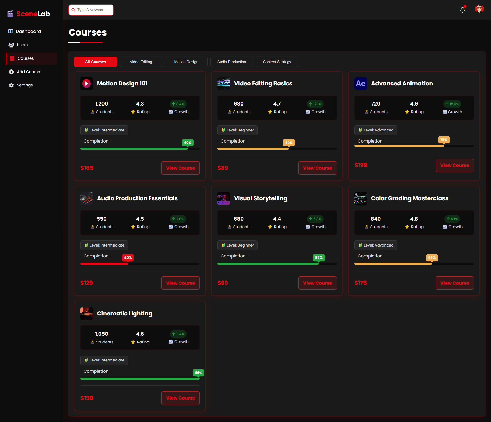
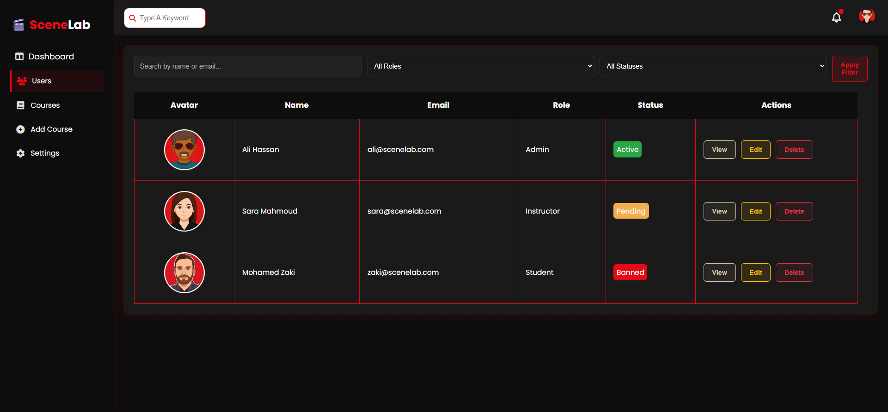

# 🎬 SceneLab – Learn Video Editing and Filmmaking

**SceneLab** is a modern, evolving web-based academy designed to teach video editing, directing, motion graphics, and creative media production. Built entirely with HTML and CSS at this stage, SceneLab will grow continuously as the developer expands skills in JavaScript, backend technologies, and interactive design.

> This is not just a project — it's a long-term journey of learning, creativity, and building a complete, professional-grade platform step by step.

---

## 🚀 Project Philosophy
SceneLab is designed to evolve alongside its developer. Every time a new concept or technique is learned, it is directly applied to the project. This includes:

- Continuous enhancement of layout, interactivity, and design  
- Modular updates to CSS and UI components  
- Implementation of future support services and admin tools  
- A growing reflection of personal growth in front-end and back-end development  

The platform also follows a **mobile-first design approach**, ensuring full responsiveness and accessibility across all screen sizes.

---

## 🧱 Pages Included

| Page                  | Description |
|-----------------------|-------------|
| `index.html`          | Public homepage with sections for courses, services, testimonials, team, and gallery |
| `login.html`          | User login page with custom layout and Google-style button |
| `register.html`       | User registration with role selection (student/instructor) |
| `dashboard-admin.html`| Admin dashboard with overview cards, charts, and task tracking |
| `courses.html`        | Course management table for admin, with filters and course cards |
| `addcourse.html`      | Add new course form with detailed fields |
| `users.html`          | Admin view of user list with role, status, and action buttons |
| `setting.html`        | Admin settings panel (profile, security, notifications) |

---

## 🎨 Visual Identity

- Dark theme design (`#0D0D0D`, `#1B1B1B`, etc.)
- Accent color: **Red** `#E50914`
- Font: **Poppins** via Google Fonts
- Modern layout with blur effects, soft transitions, hover animations, and responsive grids
- ✅ Fully responsive design for mobile, tablet, and desktop devices

---

## 🛠️ Technologies Used

- ✅ HTML5
- ✅ CSS3 (Vanilla CSS + Custom Framework)
- ✅ Flexbox & CSS Grid
- ✅ Font Awesome Icons
- ✅ Google Fonts (Poppins)

> The homepage is styled using **Vanilla CSS**, while admin pages use a custom `framework.css` — a personal modular CSS base that is updated continuously as part of the developer’s learning process.  
> This framework is **not tied to SceneLab** and will be used across future projects as a scalable foundation.

---

## 📐 Code Structure Notes

- 🎯 Public-facing pages prioritize layout control and visual storytelling.
- 🧱 Admin pages focus on utility, layout modularity, and scalable CSS architecture.
- ✨ CSS Framework is portable, optimized for flexibility, and gets updated with every new lesson or skill the developer acquires.

---
## 📸 Screenshots

## 📸 Screenshots

> *(Preview of the key pages in SceneLab)*

### 🏠 Home Page

### 📊 Admin Dashboard

### 🎓 Courses Management

### ➕ Add Course Form

### 👥 Users Management

### ⚙️ Settings Page

### 🔐 Login Page

### 📝 Register Page

---

## 🔗 Live Demo

> *(Add the link once deployed to GitHub Pages or another platform)*  
🔗 [Live Preview](#)

---

## 🔄 Development Roadmap

SceneLab is constantly evolving and will eventually include:

- JavaScript-powered components (course filtering, dashboard charts)
- Backend integration (Node.js, Firebase, or PHP/MySQL)
- Authentication and user management system
- Dynamic content management
- Full support system (FAQ, live chat, ticketing)
- Dark/light mode switch
- Multilingual support (Arabic + English)

---

## 🙋 About the Developer

**Musab Darwish**  
🎓 Front-End Developer in continuous learning  
🔗 GitHub: [musab-darwish](https://github.com/musab-darwish)

---

## 📄 License

This project was fully developed by **Musab Darwish**, with original structure, layout, and code.  
While learning resources may have contributed to the developer’s growth, **all code, design, and implementation are self-authored and original.**

You may:
- ✅ View and learn from the code  
- ✅ Adapt ideas for personal educational use  

You may **not**:
- ❌ Use the project commercially  
- ❌ Republish or claim this code as your own  

For collaborations or permission requests, please contact the developer directly.